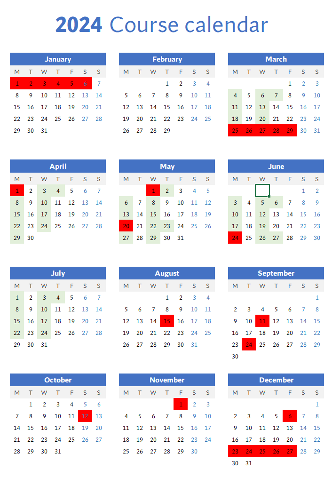

# Calendario

## Sesiones

|4-Mar|lunes|3|1|Autenticación y autorización básica|Gobernanza|Javi|
|:----|:----|:----|:----|:----|:----|:----|
|6-Mar|miércoles|3|2|Arquitectura de aplicaciones web estáticas|Aplicaciones cloud native|Javi|
|7-Mar|jueves|3|4|Introducción al Networking|Aplicaciones cloud native|Ester|
|11-Mar|lunes|3|3|Arquitectura de aplicaciones Serverless|Aplicaciones cloud native|Marcia|
|13-Mar|miércoles|3|4|Introducción al Networking|Aplicaciones cloud native|Ester|
|18-Mar|lunes|3|3|Arquitectura de aplicaciones Serverless|Aplicaciones cloud native|Marcia|
|20-Mar|miércoles|3|5|Arquitectura de aplicaciones tradicionales|Aplicaciones cloud native|Ester|
|3-Apr|miércoles|3|3|Arquitectura de aplicaciones Serverless|Aplicaciones cloud native|Marcia|
|4-Apr|jueves|3|5|Arquitectura de aplicaciones tradicionales|Aplicaciones cloud native|Ester|
|8-Apr|lunes|3|3|Arquitectura de aplicaciones Serverless|Aplicaciones cloud native|Marcia|
|10-Apr|miércoles|3|6|Arquitectura de aplicaciones tradicionales|Aplicaciones cloud native|Ester|
|15-Apr|lunes|3|9|Características avanzadas de bases de datos relacionales|Aplicaciones cloud native|Santos|
|17-Apr|miércoles|3|20|Bases de datos no-relacionales|Aplicaciones cloud native|Javi|
|22-Apr|lunes|3|10|Alta disponibilidad y elasticidad en computación clásica|Aplicaciones cloud native|Santos|
|24-Apr|miércoles|3|15|Arquitectura de aplicaciones asíncronas|Aplicaciones cloud native|Javi|
|29-Apr|lunes|3|10|Alta disponibilidad y elasticidad en computación clásica|Aplicaciones cloud native|Santos|
|2-May|jueves|3|11|Charla Pau|Aplicaciones cloud native|Pau|
|6-May|lunes|3|10|Alta disponibilidad y elasticidad en computación clásica|Aplicaciones cloud native|Santos|
|8-May|miércoles|3|9|Introducción a la infraestructura como código y GitOps|Delivery engineering, DevOps y observabilidad|Javi|
|13-May|lunes|3|19|Conceptos avanzados de Networking|Aplicaciones cloud native|René|
|15-May|miércoles|3|9|Introducción a la infraestructura como código y GitOps|Delivery engineering, DevOps y observabilidad|Javi|
|22-May|miércoles|3|21|Conceptos avanzados de Networking|Aplicaciones cloud native|René|
|23-May|jueves|3|14|Introducción a Terraform|Delivery engineering, DevOps y observabilidad|Marc Catrisse|
|27-May|lunes|3|13|Patching de Sistemas Operativos y administración de servidores|Delivery engineering, DevOps y observabilidad|Tasia|
|29-May|miércoles|3|18|Diseño y creación de pipelines de CI/CD para infraestructura clásica|Delivery engineering, DevOps y observabilidad|Marc Catrisse|
|3-Jun|lunes|3|12|Patching de Sistemas Operativos y administración de servidores|Delivery engineering, DevOps y observabilidad|Tasia|
|5-Jun|miércoles|3|17|Gobernanza integral de infraestructura cloud|Gobernanza|Samu|
|6-Jun|jueves|3|22|Seguridad avanzada|Gobernanza|Tasia|
|10-Jun|lunes|3|17|Gobernanza integral de infraestructura cloud|Gobernanza|Samu|
|12-Jun|miércoles|3|26|Implementación de planes de Disaster Recovery|Aplicaciones cloud native|Tasia|
|17-Jun|lunes|3|16|Control y gestión de costes|Gobernanza|Samu|
|19-Jun|miércoles|3|24|Contenedores|Contenerización y Kubernetes|Rael|
|26-Jun|miércoles|3|23|Diseño y ejecución de planes de migración|Gobernanza|Samu|
|27-Jun|jueves|3|8|Observabilidad de infraestructuras y aplicaciones|Delivery engineering, DevOps y observabilidad|Marc Catrisse|
|1-Jul|lunes|3|25|Contenedores|Contenerización y Kubernetes|Rael|
|3-Jul|miércoles|3|8|Observabilidad de infraestructuras y aplicaciones|Delivery engineering, DevOps y observabilidad|Marc Catrisse|
|4-Jul|jueves|3|25|Contenedores|Contenerización y Kubernetes|Rael|
|8-Jul|lunes|3|8|Observabilidad de infraestructuras y aplicaciones|Delivery engineering, DevOps y observabilidad|Marc Catrisse|
|10-Jul|miércoles|3|25|Contenedores|Contenerización y Kubernetes|Rael|
|15-Jul|lunes|3|25|Charla Tasia|Delivery engineering, DevOps y observabilidad|Tasia|
|17-Jul|miércoles|3|25|Contenedores|Contenerización y Kubernetes|Rael|
|22-Jul|lunes|3|27|Proyecto final|Proyecto final|René, Javi|
|24-Jul|miércoles|3|27|Proyecto final|Proyecto final|René, Javi|
